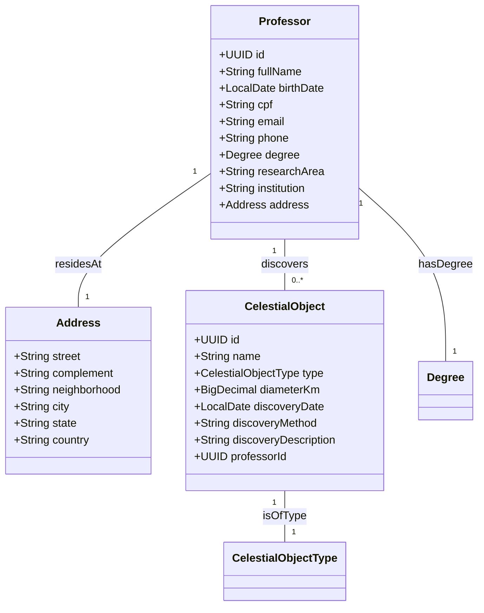

```mermaid
classDiagram
    class Professor {
        +UUID id
        +String fullName
        +LocalDate birthDate
        +String cpf
        +String email
        +String phone
        +Degree degree
        +String researchArea
        +String institution
        +Address address
    }
    class Address {
        +String street
        +String complement
        +String neighborhood
        +String city
        +String state
        +String country
    }
    class CelestialObject {
        +UUID id
        +String name
        +CelestialObjectType type
        +BigDecimal diameterKm
        +LocalDate discoveryDate
        +String discoveryMethod
        +String discoveryDescription
        +UUID professorId
    }
    class Degree
    class CelestialObjectType

    %% Relações
    Professor "1" -- "1" Address       : residesAt
    Professor "1" -- "0..*" CelestialObject : discovers
    Professor "1" -- "1" Degree        : hasDegree
    CelestialObject "1" -- "1" CelestialObjectType : isOfType

```
