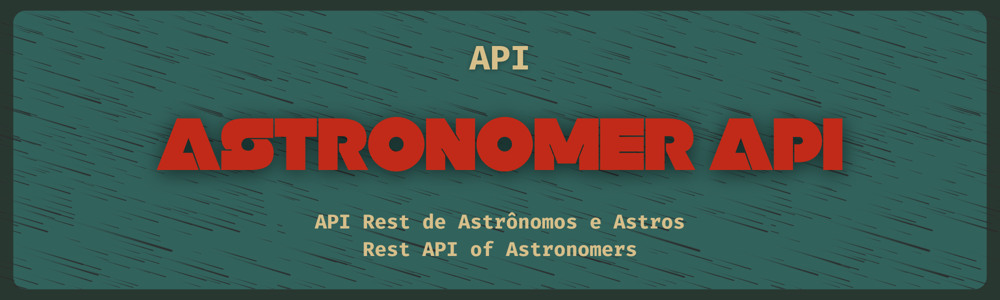
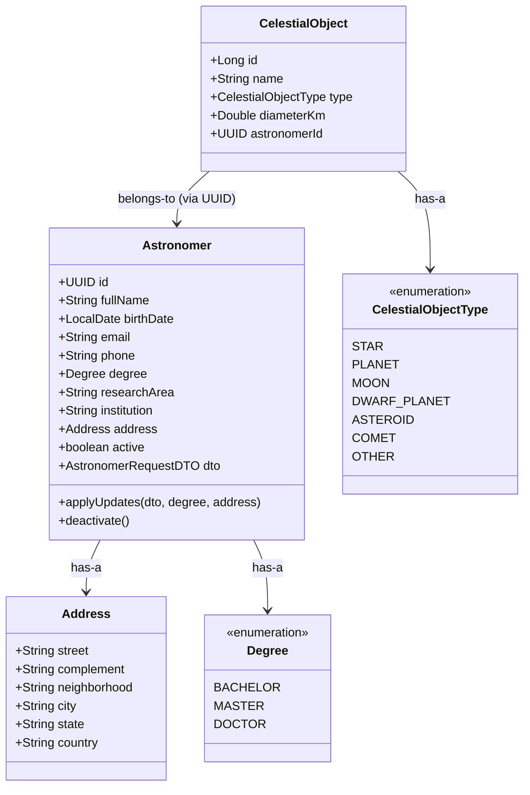

# 🔭 Astronomer API

## 📘 Sobre esta API | About this API

**PT-BR:** <br>
O objetivo dessa API foi implementar algumas práticas relevantes em Rest Apis, além de tentar seguir
um pouco mais a excelência proposta pelas RFC.
Outro ponto relevante foi o consumo de outras duas APIs para simular uma arquitetura de microsserviços,
uma API SOAP e uma api aberta (ViaCep)

**EN:** <br>
The goal of this API was to implement some relevant practices in REST APIs, while also aiming
to follow more closely the standards proposed by the RFCs.
Another important aspect was the consumption of two additional APIs to simulate a microservices architecture:
a SOAP API and an open API (ViaCep).

## 🌠 Pontos de melhoria | Areas for Improvement

**PT-BR:** <br>
A tentativa aqui foi tentar deixar a aplicação "beeem redondinha", então eu tentei minimizar diversos
pontos de melhoria, mas dois pontos ainda me saltam aos olhos:
1. **Cobertura de testes unitários:** atualmente os testes abrangem apenas a camada de _service_ e
   garantem cerca de 50% de cobertura total. Expandi-los para _controllers_, _clients_ e _cenários de erro_ aumentará
   a confiabilidade do sistema.
2. **Externalização de variáveis “mágicas”:** mover _URLs_, _namespaces_ e outros literais para o arquivo de
   propriedades (`application.properties`), isso melhoraria a configurabilidade e facilita a parametrização
   em diferentes ambientes (desenvolvimento, homologação, etc).

**EN:** <br>
The goal here was to make the application as “solid” as possible, so I tried to minimize several
points for improvement — but two still stand out:

1. **Unit test coverage:** currently, the tests only cover the _service_ layer and
achieve around 50% total coverage. Expanding tests to _controllers_, _clients_, and _error scenarios_ will increase
the system’s reliability.

2. **Externalization of “magic” variables:** move _URLs_, _namespaces_, and other literals to the
properties file (`application.properties`), which would improve configurability and ease parameterization
across different environments (development, staging, etc).

## 🌌 Sobre o Projeto | About the Project

**PT-BR:**  
Como também foi dito na documentação da CelestialObjectAPI eu sempre amei o espaço,
então poder fazer uma api que eu pudesse registrar o nome do Galileu Galilei como um
dos registros do banco foi extremamente divertido.

Confira, por favor, o diagrama abaixo do relacionamento das entidades desse projeto!

**EN:**  
As mentioned in the CelestialObjectAPI documentation, I've always loved space,
so being able to create an API where I could register the name of Galileo Galilei as one
of the database entries was extremely fun.

Please check out the entity relationship diagram of this project below!

## 🚀 Passos para Executar | Steps to Run

> 💡 Esta aplicação foi desenvolvida e testada em Linux, mas deve funcionar normalmente no Windows e macOS.  
> 💡 This application was developed and tested on Linux, but it should also work fine on Windows and macOS.

### ✅ Requisitos | Requirements

**PT-BR:**
- Java 21 instalado e com as variáveis de ambiente configuradas
- Maven instalado (utilizei a versão 3.6.3)
- Git instalado (para clonar o repositório)
- IDE de sua preferência (recomendo IntelliJ)
- MongoDB instalado localmente

**EN:**
- Java 21 installed with environment variables configured
- Maven installed (I used version 3.6.3)
- Git installed (to clone the repository)
- IDE of your choice (I recommend IntelliJ)
- MongoDB installed locally

---

### 🔧 Etapas | Steps

**1. Clonar o repositório | Clone the repository**
```bash
git clone https://github.com/DaniloVolles/AstronomerAPI.git
```

**2. Abrir o projeto na IDE de sua preferência | Open the project in your preferred IDE**  
_Recomendação | Recommendation: IntelliJ IDEA_

---

**3. Verificar testes do projeto | Verify project tests**

> ⚠️ Opcional, mas pode ajudar a verificar a integridade do projeto.
>
> ⚠️ This is optional but can help verify the integrity of the project.

```bash
mvn clean test jacoco:report
```
**PT-BR:**  
Para acessar o report encontre o caminho abaixo, lá você
verá os gráficos dos testes   
**EN:**   
To access the report, find the path below, there you will see
the tests charts

```text
target/site/jacoco/index.html
```
---

**4. Executar o projeto | Run the project**
```bash
mvn spring-boot:run
```
---

**5. Limpar o projeto | Clean the project**
```bash
mvn clean
```


## 🧪 Rodando a Aplicação | Running the Application

**PT-BR:**  
Para ver a aplicação rodando, basta importar a collection do Postman que está na pasta `resources`.

**EN:**     
To see the application running, simply import the Postman collection located in the `resources` folder.


